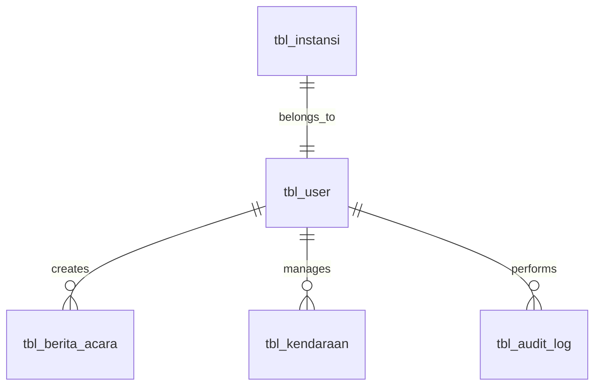

# E-Arsip API Documentation

## Overview

E-Arsip adalah sistem manajemen arsip elektronik yang menyediakan API untuk mengelola data berita acara, kendaraan, dan pengguna. API ini menggunakan arsitektur MVC dengan pattern RESTful.

## Base URL

```
http://your-domain.com/e-arsip/
```

## Authentication

Sistem menggunakan session-based authentication dengan CSRF protection.

### Login
```http
POST /login
Content-Type: application/x-www-form-urlencoded

username=admin&password=password123&csrf_token=abc123
```

**Response:**
```json
{
  "success": true,
  "message": "Login berhasil",
  "redirect": "/admin.php"
}
```

### Logout
```http
POST /logout
```

## API Endpoints

### User Management

#### Get All Users
```http
GET /users?page=1&search=keyword
```

**Parameters:**
- `page` (optional): Page number for pagination
- `search` (optional): Search keyword

**Response:**
```json
{
  "data": [
    {
      "id_user": 1,
      "username": "admin",
      "nama": "Administrator",
      "nip": "12345678901234567890",
      "admin": 1,
      "is_active": 1,
      "created_at": "2024-01-01 10:00:00",
      "last_login": "2024-01-15 09:30:00"
    }
  ],
  "total": 10,
  "per_page": 10,
  "current_page": 1,
  "last_page": 1
}
```

#### Get User by ID
```http
GET /users/{id}
```

**Response:**
```json
{
  "id_user": 1,
  "username": "admin",
  "nama": "Administrator",
  "nip": "12345678901234567890",
  "admin": 1,
  "is_active": 1,
  "created_at": "2024-01-01 10:00:00",
  "last_login": "2024-01-15 09:30:00"
}
```

#### Create User
```http
POST /users/create
Content-Type: application/x-www-form-urlencoded

username=newuser&password=password123&nama=New User&nip=09876543210987654321&admin=0&csrf_token=abc123
```

**Response:**
```json
{
  "success": true,
  "message": "User berhasil dibuat",
  "user_id": 5
}
```

#### Update User
```http
PUT /users/{id}/edit
Content-Type: application/x-www-form-urlencoded

nama=Updated Name&nip=11111111111111111111&csrf_token=abc123
```

#### Delete User
```http
DELETE /users/{id}/delete
```

#### Search Users
```http
GET /users/search?q=keyword&limit=10
```

### Berita Acara Management

#### Get All Berita Acara
```http
GET /berita-acara?page=1&search=keyword
```

**Response:**
```json
{
  "data": [
    {
      "id_berita_acara": 1,
      "no_berita_acara": "BA/001/01/2024",
      "nama_pemakai": "John Doe",
      "nip": "12345678901234567890",
      "unit_kerja": "IT Department",
      "jabatan_pembina": "Manager",
      "no_pakta_integritas": "PI/001/2024",
      "nama_kendaraan": "Honda Civic",
      "status_bpkb": "Ada",
      "no_bpkb": "BK123456789",
      "tgl_pembuatan": "2024-01-15",
      "created_by_name": "Administrator",
      "created_at": "2024-01-15 10:00:00"
    }
  ],
  "total": 25,
  "per_page": 10,
  "current_page": 1,
  "last_page": 3
}
```

#### Get Berita Acara by ID
```http
GET /berita-acara/{id}
```

#### Create Berita Acara
```http
POST /berita-acara/create
Content-Type: application/x-www-form-urlencoded

no_berita_acara=BA/002/01/2024&nama_pemakai=Jane Doe&nip=09876543210987654321&unit_kerja=HR Department&tgl_pembuatan=2024-01-16&csrf_token=abc123
```

#### Update Berita Acara
```http
PUT /berita-acara/{id}/edit
```

#### Delete Berita Acara
```http
DELETE /berita-acara/{id}/delete
```

#### Generate PDF
```http
GET /berita-acara/{id}/pdf
```

### Kendaraan Management

#### Get All Kendaraan
```http
GET /kendaraan?page=1&search=keyword&status=Aktif
```

**Parameters:**
- `status` (optional): Filter by status (Aktif, Tidak Aktif, Maintenance)

**Response:**
```json
{
  "data": [
    {
      "id_kendaraan": 1,
      "jenis_kendaraan": "Motor",
      "merk_type": "Honda Beat",
      "tahun": "2023",
      "no_polisi": "B1234XYZ",
      "warna": "Hitam",
      "no_mesin": "JH2AF6801NK123456",
      "no_rangka": "MH1JF6801NK123456",
      "penanggung_jawab": "John Doe",
      "pemakai": "Jane Smith",
      "status": "Aktif",
      "created_by_name": "Administrator",
      "created_at": "2024-01-10 14:30:00"
    }
  ],
  "total": 15,
  "per_page": 10,
  "current_page": 1,
  "last_page": 2
}
```

#### Create Kendaraan
```http
POST /kendaraan/create
Content-Type: application/x-www-form-urlencoded

jenis_kendaraan=Motor&merk_type=Yamaha Mio&tahun=2023&no_polisi=B5678ABC&no_mesin=ENGINE123&no_rangka=FRAME123&csrf_token=abc123
```

#### Update Kendaraan Status
```http
PUT /kendaraan/{id}/update-status
Content-Type: application/x-www-form-urlencoded

status=Maintenance&csrf_token=abc123
```

### Dashboard & Statistics

#### Get Dashboard Statistics
```http
GET /dashboard/statistics
```

**Response:**
```json
{
  "users": {
    "total": 25,
    "active": 23,
    "admin": 3
  },
  "berita_acara": {
    "total": 150,
    "this_month": 12,
    "this_year": 89
  },
  "kendaraan": {
    "total": 45,
    "aktif": 40,
    "maintenance": 3,
    "tidak_aktif": 2
  }
}
```

## Error Responses

### 400 Bad Request
```json
{
  "error": "Bad Request",
  "message": "Invalid input data",
  "details": {
    "field": "username",
    "error": "Username is required"
  }
}
```

### 401 Unauthorized
```json
{
  "error": "Unauthorized",
  "message": "Authentication required"
}
```

### 403 Forbidden
```json
{
  "error": "Forbidden",
  "message": "Insufficient permissions"
}
```

### 404 Not Found
```json
{
  "error": "Not Found",
  "message": "Resource not found"
}
```

### 422 Validation Error
```json
{
  "error": "Validation Error",
  "message": "Input validation failed",
  "errors": {
    "username": ["Username must be at least 3 characters"],
    "email": ["Invalid email format"]
  }
}
```

### 500 Internal Server Error
```json
{
  "error": "Internal Server Error",
  "message": "An unexpected error occurred"
}
```

## Rate Limiting

API menggunakan rate limiting untuk mencegah abuse:
- **Login attempts**: Maksimal 5 percobaan per 15 menit per IP
- **API calls**: Maksimal 100 request per menit per user
- **Search queries**: Maksimal 20 pencarian per menit per user

## CSRF Protection

Semua request POST, PUT, DELETE memerlukan CSRF token yang valid:

```javascript
// Get CSRF token from meta tag
const csrfToken = document.querySelector('meta[name="csrf-token"]').getAttribute('content');

// Include in form data
const formData = new FormData();
formData.append('csrf_token', csrfToken);
```

## Pagination

Response yang menggunakan pagination memiliki format standar:

```json
{
  "data": [...],
  "total": 100,
  "per_page": 10,
  "current_page": 1,
  "last_page": 10,
  "from": 1,
  "to": 10
}
```

## Search & Filtering

### Search Parameters
- `q` atau `search`: Keyword pencarian
- `limit`: Jumlah hasil maksimal (default: 10, max: 100)
- `page`: Halaman untuk pagination

### Filter Parameters
- `status`: Filter berdasarkan status
- `date_from`: Filter tanggal mulai (format: YYYY-MM-DD)
- `date_to`: Filter tanggal akhir (format: YYYY-MM-DD)
- `user_id`: Filter berdasarkan user ID

## File Upload

### Upload Logo Instansi
```http
POST /upload/logo
Content-Type: multipart/form-data

file=@logo.png&csrf_token=abc123
```

**Response:**
```json
{
  "success": true,
  "filename": "logo_20240115_123456.png",
  "url": "/uploads/logos/logo_20240115_123456.png"
}
```

### Supported File Types
- **Images**: JPG, JPEG, PNG, GIF (max 5MB)
- **Documents**: PDF, DOC, DOCX (max 10MB)

## Caching

API menggunakan caching untuk meningkatkan performa:
- **Query results**: Cache selama 1 jam
- **User data**: Cache selama 30 menit
- **Statistics**: Cache selama 15 menit

Cache headers:
```http
Cache-Control: public, max-age=3600
ETag: "abc123def456"
Last-Modified: Mon, 15 Jan 2024 10:00:00 GMT
```

## Monitoring & Health Check

### Health Check Endpoint
```http
GET /health
```

**Response:**
```json
{
  "status": "healthy",
  "timestamp": "2024-01-15T10:00:00Z",
  "version": "1.0.0",
  "database": "connected",
  "cache": "operational",
  "disk_space": "85% available"
}
```

## SDK & Libraries

### JavaScript SDK
```javascript
const eArsip = new EArsipAPI({
  baseURL: 'http://your-domain.com/e-arsip/',
  apiKey: 'your-api-key'
});

// Get users
const users = await eArsip.users.getAll({ page: 1 });

// Create berita acara
const beritaAcara = await eArsip.beritaAcara.create({
  no_berita_acara: 'BA/001/01/2024',
  nama_pemakai: 'John Doe'
});
```

### PHP SDK
```php
$eArsip = new EArsipAPI([
    'base_url' => 'http://your-domain.com/e-arsip/',
    'api_key' => 'your-api-key'
]);

// Get users
$users = $eArsip->users()->getAll(['page' => 1]);

// Create kendaraan
$kendaraan = $eArsip->kendaraan()->create([
    'jenis_kendaraan' => 'Motor',
    'merk_type' => 'Honda Beat'
]);
```

## Database Schema

### Tables Overview

| Table | Description | Records |
|-------|-------------|---------|
| `tbl_user` | User accounts and authentication | ~100 |
| `tbl_berita_acara` | Berita acara documents | ~1000 |
| `tbl_kendaraan` | Vehicle inventory | ~200 |
| `tbl_instansi` | Institution information | 1 |
| `tbl_audit_log` | System activity logs | ~10000 |

### Table Structures

#### tbl_user
```sql
CREATE TABLE `tbl_user` (
  `id_user` int(11) NOT NULL AUTO_INCREMENT,
  `username` varchar(50) NOT NULL UNIQUE,
  `password` varchar(255) NOT NULL,
  `nama` varchar(100) NOT NULL,
  `nip` varchar(20) NOT NULL,
  `admin` tinyint(1) DEFAULT 0,
  `is_active` tinyint(1) DEFAULT 1,
  `last_login` datetime NULL,
  `created_at` timestamp DEFAULT CURRENT_TIMESTAMP,
  `updated_at` timestamp DEFAULT CURRENT_TIMESTAMP ON UPDATE CURRENT_TIMESTAMP,
  PRIMARY KEY (`id_user`),
  INDEX `idx_username` (`username`),
  INDEX `idx_admin_active` (`admin`, `is_active`)
);
```

#### tbl_berita_acara
```sql
CREATE TABLE `tbl_berita_acara` (
  `id_berita_acara` int(11) NOT NULL AUTO_INCREMENT,
  `no_berita_acara` varchar(50) NOT NULL UNIQUE,
  `nama_pemakai` varchar(100) NOT NULL,
  `nip` varchar(20) NOT NULL,
  `unit_kerja` varchar(100) NOT NULL,
  `jabatan_pembina` varchar(100) NULL,
  `no_pakta_integritas` varchar(50) NULL,
  `nama_kendaraan` varchar(100) NULL,
  `status_bpkb` enum('Ada','Tidak Ada') DEFAULT 'Tidak Ada',
  `no_bpkb` varchar(50) NULL,
  `barang1_qty` int(11) DEFAULT 0,
  `barang1_nama` varchar(100) NULL,
  `barang2_qty` int(11) DEFAULT 0,
  `barang2_nama` varchar(100) NULL,
  `barang3_qty` int(11) DEFAULT 0,
  `barang3_nama` varchar(100) NULL,
  `barang4_qty` int(11) DEFAULT 0,
  `barang4_nama` varchar(100) NULL,
  `keterangan` text NULL,
  `tgl_pembuatan` date NOT NULL,
  `id_user` int(11) NOT NULL,
  `created_at` timestamp DEFAULT CURRENT_TIMESTAMP,
  `updated_at` timestamp DEFAULT CURRENT_TIMESTAMP ON UPDATE CURRENT_TIMESTAMP,
  PRIMARY KEY (`id_berita_acara`),
  FOREIGN KEY (`id_user`) REFERENCES `tbl_user`(`id_user`) ON DELETE RESTRICT,
  INDEX `idx_no_berita_acara` (`no_berita_acara`),
  INDEX `idx_user_date` (`id_user`, `tgl_pembuatan`),
  FULLTEXT `idx_search` (`nama_pemakai`, `unit_kerja`, `keterangan`)
);
```

#### tbl_kendaraan
```sql
CREATE TABLE `tbl_kendaraan` (
  `id_kendaraan` int(11) NOT NULL AUTO_INCREMENT,
  `jenis_kendaraan` varchar(50) NOT NULL,
  `merk_type` varchar(100) NOT NULL,
  `tahun` varchar(4) NOT NULL,
  `no_polisi` varchar(20) NOT NULL UNIQUE,
  `warna` varchar(50) NULL,
  `no_mesin` varchar(50) NOT NULL UNIQUE,
  `no_rangka` varchar(50) NOT NULL UNIQUE,
  `penanggung_jawab` varchar(100) NULL,
  `pemakai` varchar(100) NULL,
  `keterangan` text NULL,
  `status` enum('Aktif','Tidak Aktif','Maintenance') DEFAULT 'Aktif',
  `id_user` int(11) NOT NULL,
  `created_at` timestamp DEFAULT CURRENT_TIMESTAMP,
  `updated_at` timestamp DEFAULT CURRENT_TIMESTAMP ON UPDATE CURRENT_TIMESTAMP,
  PRIMARY KEY (`id_kendaraan`),
  FOREIGN KEY (`id_user`) REFERENCES `tbl_user`(`id_user`) ON DELETE RESTRICT,
  INDEX `idx_no_polisi` (`no_polisi`),
  INDEX `idx_jenis_tahun` (`jenis_kendaraan`, `tahun`),
  INDEX `idx_status` (`status`),
  FULLTEXT `idx_search` (`merk_type`, `penanggung_jawab`, `pemakai`)
);
```

### Relationships


